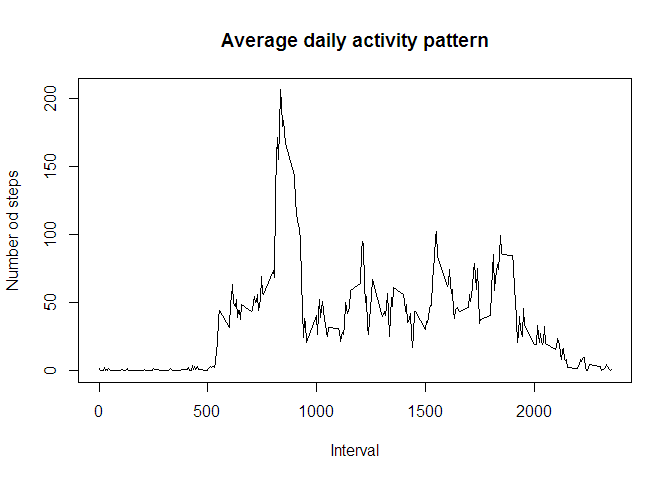

# Reproducible Research: Peer Assessment 1


## Loading and preprocessing the data
Load the data

```r
data <- read.csv(unz("activity.zip", "activity.csv"), na.strings = "NA", stringsAsFactors = FALSE)
```
Removing the obs. which have NA value in steps col

```r
data <- data[!is.na(data[, 1]), ]
```

## What is mean total number of steps taken per day?
1. Calculate the total number of steps taken per day

```r
library(dplyr)
```

```
## 
## Attaching package: 'dplyr'
## 
## The following object is masked from 'package:stats':
## 
##     filter
## 
## The following objects are masked from 'package:base':
## 
##     intersect, setdiff, setequal, union
```

```r
data_stepsperday <- data %>%
                         group_by(date) %>%
                         summarize(stepsperday = sum(steps, na.rm = TRUE))
```
2. Make a histogram of the total number of steps taken each day  

```r
hist(data_stepsperday$stepsperday, 
     main = "Histogram of stepsPerDay", 
     xlab = "steps", 
     ylab = "days",
     ylim = c(0, 40))
```

 

3. Calculate and report the mean and median of the total number of steps taken per day

```r
summary(data_stepsperday$stepsperday)
```

```
##    Min. 1st Qu.  Median    Mean 3rd Qu.    Max. 
##      41    8841   10760   10770   13290   21190
```

## What is the average daily activity pattern?
1.Make a time series plot (i.e. type = "l") of the 5-minute interval (x-axis) and the average number of steps taken, averaged across all days (y-axis)

```r
data_avgstepsperinterval <- data %>%
                                 group_by(interval) %>%
                                 summarize(avgstepsperinterval = mean(steps, na.rm = TRUE))

with(data_avgstepsperinterval, {
    plot(interval, avgstepsperinterval, 
         type = "l", 
         main = "Average daily activity pattern", 
         xlab = "Interval",
         ylab = "Number od steps")
})
```

 

2. Which 5-minute interval, on average across all the days in the dataset, contains the maximum number of steps?

```r
maxsteps <- max(data_avgstepsperinterval$avgstepsperinterval, na.rm = TRUE)
index <- which(data_avgstepsperinterval$avgstepsperinterval == maxsteps)
data_avgstepsperinterval$interval[index]
```

```
## [1] 835
```

## Imputing missing values
Note that there are a number of days/intervals where there are missing values (coded as NA). The presence of missing days may introduce bias into some calculations or summaries of the data.  
1. Calculate and report the total number of missing values in the dataset (i.e. the total number of rows with NAs)

```r
data_complete <- read.csv(unz("activity.zip", "activity.csv"), na.strings = "NA", stringsAsFactors = FALSE)
count(data_complete) - count(data)
```

```
##      n
## 1 2304
```
2. Devise a strategy for filling in all of the missing values in the dataset.   
*I use the mean steps for that 5-minute interval to fill that missing values, so the activity pattern would not be changed.*  

3. Create a new dataset that is equal to the original dataset but with the missing data filled in.

```r
index_to_fill <- which(is.na(data_complete$steps))
for (i in index_to_fill){
    data_complete$steps[i] =  with(data_avgstepsperinterval, {
                              avgstepsperinterval[interval == data_complete$interval[i]]
                              })
}
```
4. Make a histogram of the total number of steps taken each day and Calculate and report the mean and median total number of steps taken per day. 

```r
data_complete_stepsperday <- data_complete %>%
                             group_by(date) %>%
                             summarize(complete_stepsperday = sum(steps, na.rm = TRUE))
hist(data_complete_stepsperday$complete_stepsperday, 
     main = "Histogram of stepsPerDay (missing values filled)", 
     xlab = "steps", 
     ylab = "days",
     ylim = c(0, 40))
```

 

```r
summary(data_complete_stepsperday$complete_stepsperday)
```

```
##    Min. 1st Qu.  Median    Mean 3rd Qu.    Max. 
##      41    9819   10770   10770   12810   21190
```
*Obviously, these values differ from the estimates from the first part of the assignment.*  
*The impact of imputing missing data on the estimates of the total daily number of steps is the different quantity of samples.*

## Are there differences in activity patterns between weekdays and weekends?
1. Create a new factor variable in the dataset with two levels – “weekday” and “weekend” indicating whether a given date is a weekday or weekend day.

```r
Sys.setlocale("LC_TIME", "English")
```

```
## [1] "English_United States.1252"
```

```r
data <- mutate(data, isweekday = weekdays(as.Date(data$date)))
for(i in 1:nrow(data)){
    if(data$isweekday[i] == "Sunday" | data$isweekday[i] == "Saturday"){
          data$isweekday[i] <- "Weekend"
    }else{
          data$isweekday[i] <- "Weekday"
    }
}
```
2. Make a panel plot containing a time series plot (i.e. type = "l") of the 5-minute interval (x-axis) and the average number of steps taken, averaged across all weekday days or weekend days (y-axis). 

```r
data_weekdaystepsperinterval <- data %>%
                                group_by(isweekday, interval) %>%
                                summarize(avgstepsperinterval = mean(steps, na.rm = TRUE))
library(lattice)
with(data_weekdaystepsperinterval, {
    xyplot(avgstepsperinterval ~ interval | isweekday, 
           layout = c(1, 2),
           type = "l", 
           main = "Average daily activity pattern", 
           xlab = "Interval",
           ylab = "Number od steps")
})
```

 


